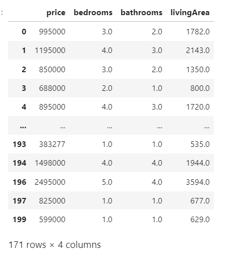
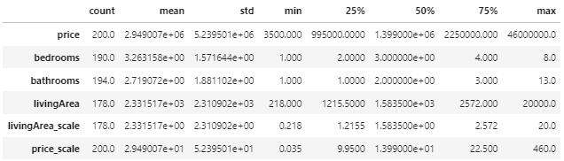
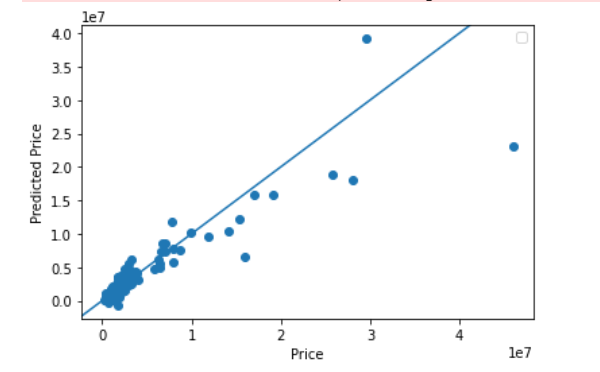

# Zillow Home Prediction Model 
#### Introduction to the Data
In this project I scrapped 200 homes from a city of my choice via Zillow. I used predictors (specifically number of bedrooms, bathrooms and totally square footage) to train a model with the goal of being able to predict the price of each house based on its features. This project will go through the process of cleaning the dataset, fitting a model, and analyzing its results.
#### Beginning with the Data 
I chose San Francisco, California as my city to collect data from via Zillow. I did have trouble using Amplify, for some reason I was not able to access larger files without having to update to a premium account. As a result, I was only able to scrape 200 houses for my dataset. This is on the smaller side so, I believe this is one of the biggest area I can improve upon my model in the future. Once, I collected the information from Zillow I created a dataframe and cleaned the data by dropping rows with NaN values and downsized the data through scaling to help the model. This left my data ready for modeling. 
#### Data Description 
I began my project with the descriptive statistics of the 200 houses in San Francisco. In Figure 1, see that the average cost of housing is $2,949,007, the median price is $1,399,000. This shows that overall San Francisco is a more expensive city. I find it interesting that in Figure 2 we see most houses are four bedrooms three bathrooms and while that is a bigger home isn't typically what I would imagine when I think of a $1.3 million dollar home.
  *Figure 1*

  *Figure 2*

- How did your model fare?
  - Answer: My model went okay, while the MSE was fairly high (560.195) indicating a large amount of error in the model, when it came to predicting prices at a generally lower price the model did far better than predicting models at a higher price. 
  
    
- In your estimation is there a particular variable that may improve model performance?
  - Answer: I think looking at neighborhods/zip codes would improve the models performance. Neighborhoods are often sectioned off by prices and have similar sized homes so being able to examine where in the city a house is located would help to improve price predictions.
- Which of the predictions were the most accurate? In which percentile do these most accurate predictions reside? Did your model trend towards over or under predicting home values?
  - Answer: The houses lower in price were the most accurate, the most accurate predictions are around the  25th percentile. My model tended to under predict the values of the home.
- Which feature appears to be the most significant predictor?
    - Answer: Square footage appeared to be the most significant predictor when square footage went up housing prices usually followed as well. 
  