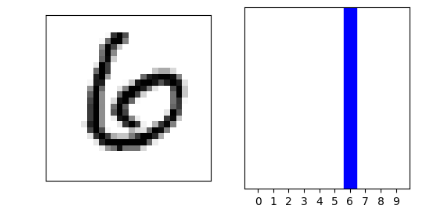
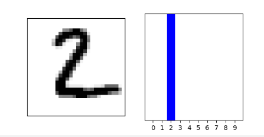

# Informal Reponse 

- Produce 3 new images: 
    - 
    - 
    - 
    
- Array of predictions other than example array: 
    - What does this array represent? 
      - Answer: how likely it is that the image corresponds to each of the ten labels presented 
    - How were the Softmax() and argmax() functions aplied? 
      - Answer: Softmax() was used to transform all the values in our predictions to a number between 0 and 1 in an attempt to make it easier for us to interpret. Argmax() gave us the highest value of these number aka which label/article of clothing the photo was most likely to be. 
    - Does the output label from np.argmax() match test_labels dataset?
      - Answer: yes for predicting image #1 both of my labels came out as 2
- Two Plotted Additional Images with image and predicted label: 
  - 
  - 
- New test dataset 
    - Does the predicted value match the test label?
      - Answer: Yes, it was predicted to be a pullover and it was 
    - Why did we not use Softmax() a second time? 
      - Answer: We did not use Softmax() because we were only grabbing the predictions for the single image in our batch instead of getting a list of lists for each image in the batch of data
    - Evaluate how your model for the MNIST dataset compared with your model of the Fashion_MNIST dataset. Which of the two models is more accurate? Why do you think this is so?
        - Answer: The MNIST dataset was more accurate at 98% versus the Fashion_MNIST at 91%. I think it's more accurate because its out preforming the Fashong_MNIST in the training and testing data so it is making better predictions more of the time. 
    - MNST Results: 
        - Train Accuracy: 98%
        - Test Accuracy: 99%
        - Images: 
            - 
            - 