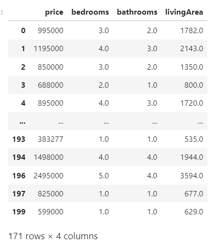
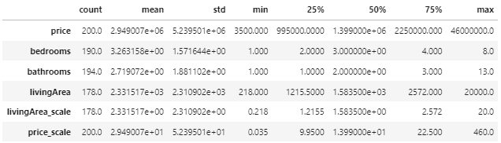
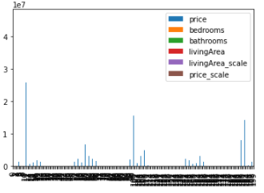
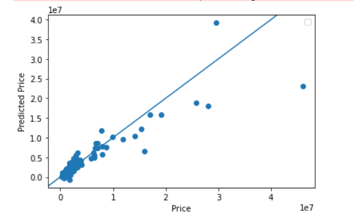
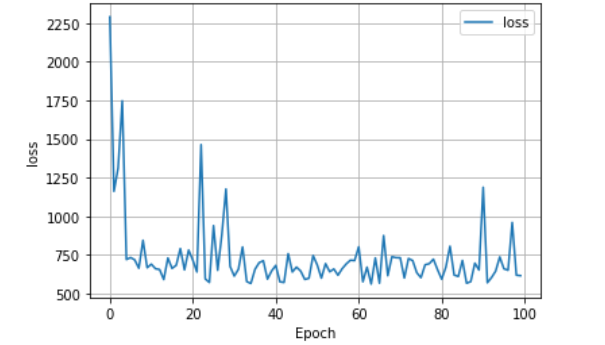
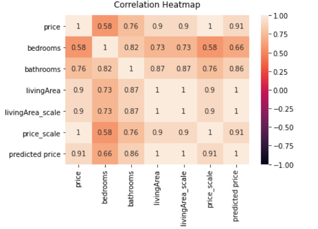

# Zillow Home Prediction Model 
#### Introduction to the Data
In this project I scrapped 200 homes from a city of my choice via Zillow. I used predictors (specifically number of bedrooms, bathrooms and totally square footage) to train a model with the goal of being able to predict the price of each house based on its features. This project will go through the process of cleaning the dataset, fitting a model, and analyzing its results.
#### Beginning with the Data 
I chose San Francisco, California as my city to collect data from via Zillow. I did have trouble using Amplify, for some reason I was not able to access larger files without having to update to a premium account. As a result, I was only able to scrape 200 houses for my dataset. This is on the smaller side so, I believe this is one of the biggest area I can improve upon my model in the future. Once, I collected the information from Zillow I created a dataframe and cleaned the data by dropping rows with NaN values and downsized the data through scaling to help the model. This left my data ready for modeling. 
  - 
#### Data Description 
I began my project with the descriptive statistics of the 200 houses in San Francisco. In Figure 1, see that the average cost of housing is $2,949,007, the median price is $1,399,000. This shows that overall San Francisco is a more expensive city. I find it interesting that in Figure 2 we see most houses are four bedrooms three bathrooms and while that is a bigger home isn't typically what I would imagine when I think of a $1.3 million dollar home.
  - *Figure 1*
    - 
  - *Figure 2*
    - 
      - *for this graph I wanted to compare housing prices to number of bedrooms and bathrooms in a home to price but when attempting to put the price on the x-axis I got this error message* 
      - ValueError: x must be a label or position
  #### Methods and Training 
To analyze the data I used TensorFlow to train the model. I complied the data into three layers. After training the model I predicted housing prices and added that to my dataframe as a column. I also produced a heat map to show correlation between price and different features within the model. These are my results. 
  - *figure 3*
   
  - *figure 4*
   
  - *figure 5*
    
    ### Personal Findings
    I found that my model preformed terribly the MSE was very high at 602.71. I think this could be for a lot of reasons, but my first suspicion is the amount of data I had available. While I'm sure lots of things went wrong the limited amount of data I had probably did not help. If I had to add anything to this model to improve it I would look into how to add categorical data to it such as zip codes or neighborhood labels. In my personal experience I know neighborhoods tend to be grouped off by price so by giving this additional information I think it could allow the model to predict the price more accurately. 
    I found from my scatter graph that the lower the houses were in price the more accurate the predicted prices tended to be. When the houses became more expensive the model had a more difficult time to predict the price. Most of the accurate predictions appear in the 25th percentile. From the Line of Best Fit graph, it looked as though my model tended to under predict the home values although I am not sure why. I think I could improve the model by removing these outliers or trying to add another parameter (such as zipcode) to help improve the model as well. 
    From the heatmap I concluded that Square Footage as the most effect on price with a correlation of 90%. 
 
### Conclusion 
In conclusion, while I don't think my model was the best, I think it still shed a healthy light on the housing market in San Francisco. There are many ways to go about improving this model: scraping more data, splitting into test/training sets, adding more parameters etc. The biggest struggle I had in this project was labeling things correctly and getting them into the correct dimensions. This project took me longer to do because I couldn't get my X and y values into their proper form and shape. For improvements, I would like to be able to represent my bar graph in it's intended form and go a little deeper into understanding my mse. A place of confusion for this project was my Figure 4 graph, I don't completely know how to read it or exactly what it means well enough to explain how it impacted my projects or my findings. As a stretch goal I would like to make predictions on best housing deals by subtracting predicted price with actual price. Thank you for reading! 