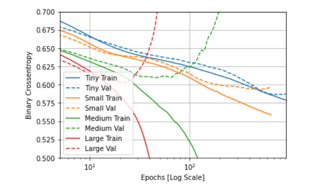

#HIGGS Dataset 
- Describe the dataset. What type of variable is the target? How many features are being used? How many observations are in the training dataset? How many are used in the validation set?
    - The variable type for the target is binary. 
      
  - Twenty-eight features are being used. 
    
  - There are 11 million observations 
    
  - 1,000 are being used for validation 
    
  - 10,000 are being used for testing

- How did each of the four models perform (tiny, small, medium and large)? Which of the four models performed the best? Which ones performed the worst? Why in your estimation did certain models perform better? Produce a plot that illustrates and compares all four models.
     
    - My tiny model preformed the best out of all the models I tested
    - The large and medium models preformed the worst 
    - I believe the smaller models preformed better because it has less room to allow for overfitting. The larger models matched the training data too well which allowed for noise to be considered as well and messed up the model. 
  
- Apply regularization, then add a drop out layer and finally combine both regularization with a dropout layer. Produce a plot that illustrates and compares all four models. Why in your estimation did certain models perform better?
    
  - All of these are models that had some sort of overfitting prevention method placed on them. The worst model was the one without any adjustment. I believe certain models preformed better than others because it combined the best of the two other methods into one which allowed for optimization.
- What is an overfit model? Why is it important to address it? What are four different ways we have addressed an overfit model thus far?
  - A model that matches the training data too well, it learns the details and the noise of the training set so well that it negatively effects new data going into the model.  It's important to address it because if we don't the model will not preform well on new testing data as it will be too specific to the training data. We can prevent overfitting data with these four things:
    - Get more training data.
    - Reduce the capacity of the network.
    - Add weight regularization.
    - Add dropout.