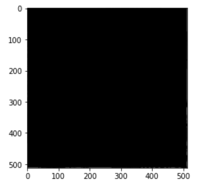
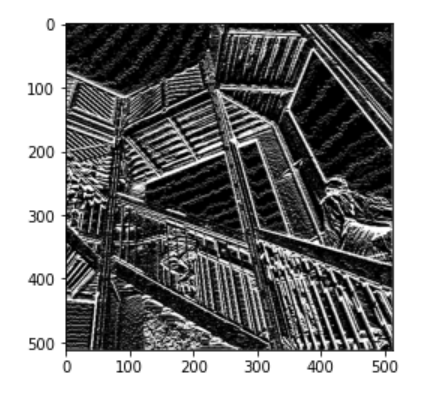
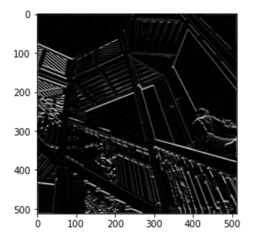
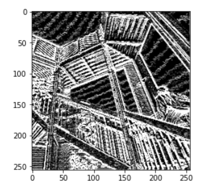

### Part 2 (Wednesday No Class Response)
Modify the existing filter and if needed the associated weight in order to apply your new filters to the image 3 times. Plot each result, upload them to your response, and describe how each filter transformed the existing image as it convolved through the original array and reduced the object size.

For the first filter I wanted to see what would happen with bigger numbers, it seems that it removed ALL information to including the straight lines to leave us with a black screen so, going to high is not helpful when it comes to convolutions.

    filter = [ [-400, 0, -400], [0, 0, 0], [1, 2, 1]]

- 

The second filter was the best in my opinion, it highlighted straight lines so detailed that even wiggly lines were highlighted, while I'm not sure if it would be best for a model it did provide the most information out of all of my filters. 

    filter = [ [-45, 0, 45], [-4, 0, 4], [-7, 0, 7]]

- 
    
The third filter was okay it did highlight straight lines, but it left out a lot of detail, and I don't think it would do very well outside a training data set.

    filter = [ [0, 1, 0], [1, -4, 1], [0, 1, 0]]

- 
  
Each different filter learns how to isolate and take out specific features within them that are deemed important, this in turn changes the data set so that different details in the photo are emphasized. 

What are you functionally accomplishing as you apply the filter to your original array? 
- I am implementing 3 arrays and 3 items as a filter to an image that I turned into an array to filter out specific features so that my computer can identify these features to better train my model. 

Why is the application of a convoling filter to an image useful for computer vision? 
- This is usual because it helps save memory and time when a machine is attempting to fit a model because instead of trying to account for many variable it is isolating similar features and running a model based off of the features that are seen consistently. 

Another useful method is pooling. Apply a 2x2 filter to one of your convolved images, and plot the result.
-  
 
In effect what have you accomplished by applying this filter? Does there seem to be a logic (i.e., maximizing, averaging or minimizing values?) associated with the pooling filter provided in the example exercise (convolutions & pooling)? Did the resulting image increase in size or decrease? Why would this method be useful?
- I have been able to cut the size of this image down to be even smaller than the original image and gather more information for the model. From the code I ran it did not seem as though the pooling was attempting to maximize; seems like it is going through in smaller sections taking the most prevalent pixel and adding that pixel to other big pixels to make the image we see above. While this is a simpler method of pooling it is still very effective in gathering information and allowing a model to train better.  

Manuel Convolution 
- I found the new matrix to be a 7x7 matrix with an assortment of 3's, 1's, and 0's placed throughout. 
