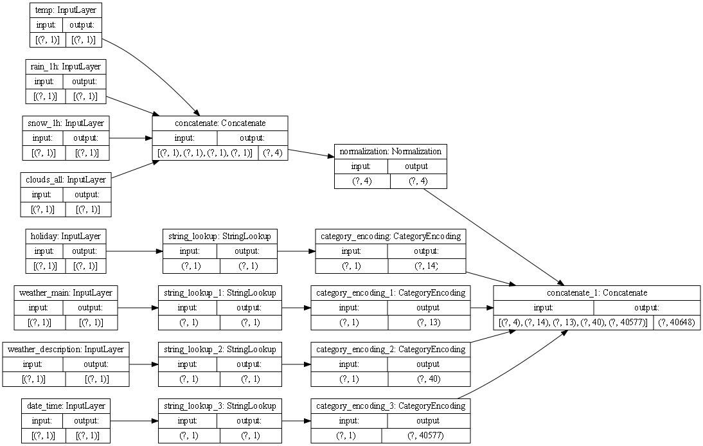
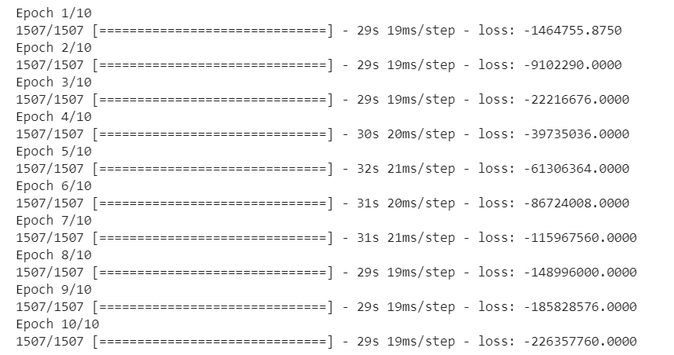

### Metro_Interstate_Traffic_Volume Dataset 
- Use the `plot_model()` command from `tf.keras.utils` to produce the plot that describes the input preprocessing step. Describe the plot of each model for the two dataset preprocessing steps. What does each box in the illustration represent? Are there different paths towards the final concatenation step?  What is occurring at each step and why is it necessary to execute before fitting your model.
      
    - This graph is providing a computation based modification to each feature based on class. It is concatenating each class into an object that provides a shape for each object of concatenation. (We can see in my graph that we are concatenating a four dimensional object). The graph then shows the normalization of those concatenations, for categorical features though we have to modify them (usually with binary) before concatenation. In my graph there are multiple paths because we have multiple classes specifically categorical and numerical. This has to be done before fitting our model because of the different data types and ranges we have present in our data. We can't stack features into a NumPy array and pass it to keras, all columns have to be handled on their own. 
    
  
- Train each model and produce the output (not necessary to validate or test).  Describe the model output from each of the trained metro traffic interstate dataset, and the iris flowers dataset.  What is the target for each dataset?  How would you assess the accuracy of each model?  Are you using a different metric for each one?  Why is this so?  What is each one measuring?
    
  - The target for the Metro Traffic Interstate Data was the Traffic_Volume. assesed the accuracy of this model by passing a dictionary of features as x, and the data label as y. We are using a different metric for the Interstate Data over the Flower Data because they contain different class features. 
### Iris_Flowers Dataset 

- Producing the graph for dataset proved to be more of a challenge. When trying to concatenate my layers it was taking issues with the inputs. After further inspecting the data I believe the issue came somewhere in the preprocessing phase. The Iris species data set has 3 potential inputs due to the three types of flowers. I played around the Category Encoding and tried to re-append the pre_processed inputs, but I still received the error down below. I would love to be able to visualize exactly how the model was preprocessing the data because I think I could identify the error sooner. A stretch goal could be figuring out a way to graph or visually model the pre-processing stage for better conceptual understanding. 
    - ValueError: A `Concatenate` layer should be called on a list of at least 2 inputs
    
- The target for the Flowers dataset is the species. I assess the accuracy for this dataset by training the model using a dictionary of features as the x values and the labels as the y. I was able to fit the model through ten layers and calculate the loss by fitting. I am using different metrics for each dataset because there is a difference in the class type for the data in each set. 