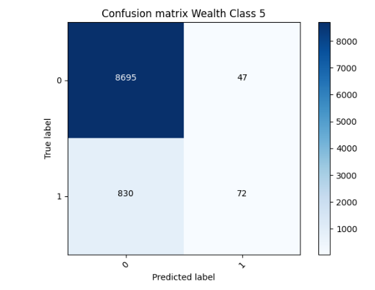
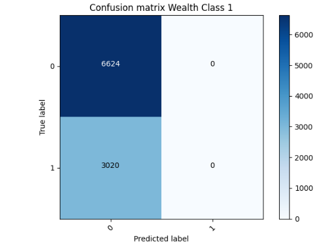

###Abstraction
For this project I used the country_person.csv dataset to specify, train and evaluate models  that predict class of wealth versus all other classes as a binary target. 
After receiving the accuracies for these models I investigated the datasets further using confusion matrices. From these matrices I was able to hypothesize possible solutions to improve the model's accuracy. 
Once the accuracies improved I analyzed and documented my results below. 

###The Best and Worst Binary Models
To begin this project I imported the country_persons.csv dataset and checked for any missing values within my data.
For preprocessing I changed the gender column from binary to categorical labels and created a target column where the wealth class I was analyzing was equal to one and all other values were assigned to zero.
The last step in my preprocessing was removing any columns I would not use during my analysis. I chose to drop weights, unit, hhid, location and pnmbr. 

    dataframe['gender'] = np.where(dataframe['gender'] == 1, 'male', 'female') 
    dataframe['target'] = np.where(dataframe['wealth']== (insert wealth class here, 1, 0)
    dataframe = dataframe.drop(columns=['weights','unit','hhid','location','pnmbr'])
My best model was for wealth class 5 with a loss and accuracy of: 

    loss: 0.2846 - accuracy: 0.9057

My worst model was for wealth class 1 with a loss and accuracy of: 

    loss: 0.5935 - accuracy: 0.6866

These models are both binary classifications models which had 1 predicted wealth class versus all other wealth classes. 
Both of my models had an 128-neuron dense layer, a feature column layer, and a 0.1 dropout layer. 
Both models used gender as an indicator column, age as a bucketized column and size and education as numeric columns. 

    for header in ['age', 'size', 'education']:
    feature_columns.append(feature_column.numeric_column(header))
    age = feature_column.numeric_column('age')
    age_buckets = feature_column.bucketized_column(age, boundaries=[30, 60])
    feature_columns.append(age_buckets)
    indicator_column_names = ['gender']
    for col_name in indicator_column_names:
    categorical_column = feature_column.categorical_column_with_vocabulary_list(
    col_name, dataframe[col_name].unique())
    indicator_column = feature_column.indicator_column(categorical_column)
    feature_columns.append(indicator_column)

Both of these models are okay but after producing the confusion matrices we can see that there is a data imbalance issue with the model being more likely to predict a 0 than a 1. 
Since we are using binary our results are skewing negative due to the data being primarily in the lower wealth class (so they have more datapoints to be considered) as well as preprocessing some of our data to be in binary which results in more zeros within the data.
While we were able to fix some of this imbalance by using sigmoid instead of softmax in our confusion matrices we still see that these models aren't preforming the best. 
We will look at ways to improve this by considering a multi-class model. 

### Multi-Class Categorical Model 

### Improving the model 