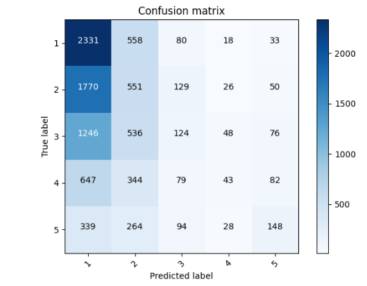
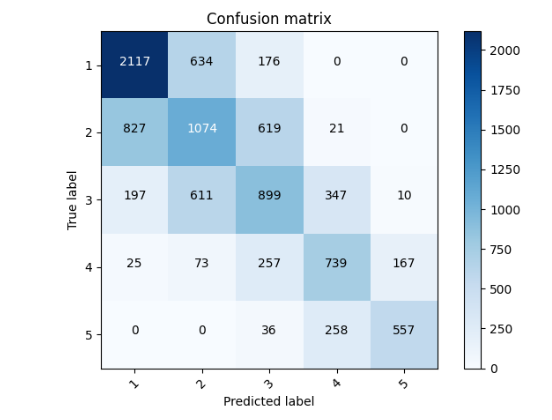
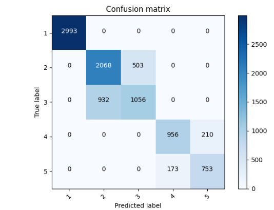

###Abstraction

For this project I used the country_person.csv dataset to specify, train and evaluate models  that predict class of wealth versus all other classes as a binary target. 
After receiving the accuracies for these models I investigated the datasets further using confusion matrices. From these matrices I was able to hypothesize possible solutions to improve the model's accuracy. 
Once the accuracies improved I analyzed and documented my results below. 

###The Best and Worst Binary Models

To begin this project I imported the country_persons.csv dataset and checked for any missing values within my data.
For preprocessing I changed the gender column from binary to categorical labels and created a target column where the wealth class I was analyzing was equal to one and all other values were assigned to zero.
The last step in my preprocessing was removing any columns I would not use during my analysis. I chose to drop weights, unit, hhid, location and pnmbr. 

    dataframe['gender'] = np.where(dataframe['gender'] == 1, 'male', 'female') 
    dataframe['target'] = np.where(dataframe['wealth']== (insert wealth class here, 1, 0)
    dataframe = dataframe.drop(columns=['weights','unit','hhid','location','pnmbr'])
My best model was for wealth class 5 with a loss and accuracy of: 

    loss: 0.2846 - accuracy: 0.9057

My worst model was for wealth class 1 with a loss and accuracy of: 

    loss: 0.5935 - accuracy: 0.6866

These models are both binary classifications models which had 1 predicted wealth class versus all other wealth classes. 
Both of my models had an 128-neuron dense layer, a feature column layer, and a 0.1 dropout layer. 
Both models used gender as an indicator column, age as a bucketized column and size and education as numeric columns. 

    for header in ['age', 'size', 'education']:
    feature_columns.append(feature_column.numeric_column(header))
    age = feature_column.numeric_column('age')
    age_buckets = feature_column.bucketized_column(age, boundaries=[30, 60])
    feature_columns.append(age_buckets)
    indicator_column_names = ['gender']
    for col_name in indicator_column_names:
    categorical_column = feature_column.categorical_column_with_vocabulary_list(
    col_name, dataframe[col_name].unique())
    indicator_column = feature_column.indicator_column(categorical_column)
    feature_columns.append(indicator_column)

Both of these models are okay but after producing the confusion matrices we can see that there is a data imbalance issue with the model being more likely to predict a 0 than a 1. 
Since we are using binary our results are skewing negative due to the data being primarily in the lower wealth class (so they have more datapoints to be considered) as well as preprocessing some of our data to be in binary which results in more zeros within the data.
While we were able to fix some of this imbalance by using sigmoid instead of softmax in our confusion matrices we still see that these models aren't preforming the best. 
We will look at ways to improve this by considering a multi-class model. 

### Model with Multi Class and Improvements 
The next model I performed as a multi-class problem that predicted wealth class as categorical data. Here are the results of accuracy and the confusion matrix.
    
    loss: 1.4660 - sparse_categorical_accuracy: 0.3315

We can see that the accuracy for this model is not very high and that it is predicting the lower wealth class better than the higher wealth classes. When we are comparing all classes against each other instead of two it makes sense that the model is more likely to predict incorrectly when it goes from having 2 options to predict from to 5.
So how can we improve this model?

To improve this model I began by going back to my original country_person.csv dataset and cleaning the data. I removed missing values from "age" and "education". This time around I kept the location column in the dataframe as well. 
I used 'age', 'size', and 'education' as numeric columns. I bucketized education and age as well (I used numeric and bucketized on these two columns on purpose.) Then I used the indicator column on 'gender', 'location', 'potable', 'toilet', and 'cook'. I recompiled and fit my model to receive a new accuracy of:
    
    loss: 0.9663 - sparse_categorical_accuracy: 0.5585

We can see that just with these small changes our improvement is significantly better from our original model. Our model has more information and better ranges thanks to our indicator and bucketized columns to predict information accurately. While this model is still performing decently I wanted to challenge myself to see if I could get an even better performing model. 
To do this I decided change 'toliet' and 'potable' into numeric values and bucketize those results. I increased my dropout layer to help with overfitting. I also added car and electric to the indicator column. This gave me the best results by far I'm sure it's because there was some overfitting since I decided to change some of the categorical data to binary, I would need a line graph on testing and training data to see myself however, for the purpose of this project, and my own curiosity I wanted to try. Here are those results: 

    loss: 0.3685 - sparse_categorical_accuracy: 0.8115

This model gave the best results by far and showed that the model had a harder time differing from people in similar wealth class and likely similar living circumstances. It helped to get rid of incorrect outliers in the prediction and made for the highest accuracy. I have a feeling if I went in and cleaned up some more of the dataset columns, turned location into binary then bucketized that column I would have a higher accuracy as well. 

### Final Thoughts 
The biggest realization I took away from this project was how important data cleaning and preprocessing is. By cleaning my data I was able to almost double my accuracy without having to change anything about my model. When I was preforming certain techniques onto my unclean data the improvements in accuracy were nowhere near as high as they were on the cleaned data. Having a good size of cleaned and organized data is going to be the best way to improve your model. While certain techniques are helpful they'll only do so much if your data is not prepped well. Multi Class problems are sometimes better than binary even if the accuracy is lower because it allows us to better understand the scope of the data in the real world and provide corrections for it's natural quirks. Overall I am very happy with the improvements I was able to make to my models. 