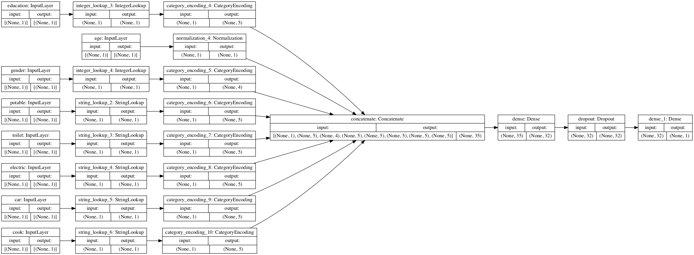

### Partner work with Aahni Manroa 

#### The data 
Today we looked at the country_person.csv file. We began by reading the file in to a dataframe then removing features we were not utilizing in this model. We removed weights, unit, pnmbr, hhid, location and size. Once the data was cleaned we moved on to training the model. 

    dataframe['target'] = np.where(dataframe['wealth']==2, 0, 1)
    dataframe = dataframe.drop(columns=['wealth','weights','unit','pnmbr','hhid','location','size'])

#### The Model 
We split our data up and had 30860 train examples, 7715 validation examples and 9644 test examples. We created an input pipeline using tf.data to shuffle and batch the data. Then we used normalization layer for each of our feature columns. We encoded two of our categorical features, gender and education, as integers. Then encoded the rest of our categorical features, cook, car, electric, potable and toilet, as strings. We created, compiled and trained our model to compute the accuracy. Here are our findings.

    train, test = train_test_split(dataframe, test_size=0.2)
    train, val = train_test_split(train, test_size=0.2)

    age_col = tf.keras.Input(shape=(1,), name='education', dtype='int64')
    encoding_layer = get_category_encoding_layer('education', train_ds, dtype='int64',
    max_tokens=5)
    encoded_age_col = encoding_layer(age_col)
    all_inputs.append(age_col)
    encoded_features.append(encoded_age_col)

    gender_col = tf.keras.Input(shape=(1,), name='gender', dtype='int64')
    encoding_layer = get_category_encoding_layer('gender', train_ds, dtype='int64',
    max_tokens=5)
    encoded_gender_col = encoding_layer(gender_col)
    all_inputs.append(gender_col)
    encoded_features.append(encoded_gender_col)
    categorical_cols = ['cook', 'car','electric','potable', 'toliet']
    for header in categorical_cols:
    categorical_col = tf.keras.Input(shape=(1,), name=header, dtype='string')
    encoding_layer = get_category_encoding_layer(header, train_ds, dtype='string',
    max_tokens=5)
    encoded_categorical_col = encoding_layer(categorical_col)
    all_inputs.append(categorical_col)
    encoded_features.append(encoded_categorical_col)

    model.fit(train_ds, epochs=10, validation_data=val_ds)

#### Our Results 
Below are our losses and accuracies for each of the wealth classes. Interestingly, as the wealth class became higher, so did our accuracy. This is in contrast to the model that we made yesterday, where the lower wealth classes had a higher accuracy.
    
    For wealth class 2 (35476 points) -
    Loss: 0.5058
    Accuracy: 0.7019909024238586
    For wealth class 3 (38113 points) -
    Loss: 0.4481
    Accuracy: 0.7735379338264465
    For wealth class 4 (42191 points) -
    Loss: 0.2372
    Accuracy: 0.8971381187438965
    For wealth class 5 (43714 points) -
    Loss: 0.1082
    Accuracy: 0.9585234522819519
In conclusion, this model performed better on higher wealth classes. The loss also decreased as the wealth class increased. This could be because the amount of points per wealth class increased with each class, so the model had more points to train on. Another possible explanation for this ascending accuracy could be the normalization function that we added in.
