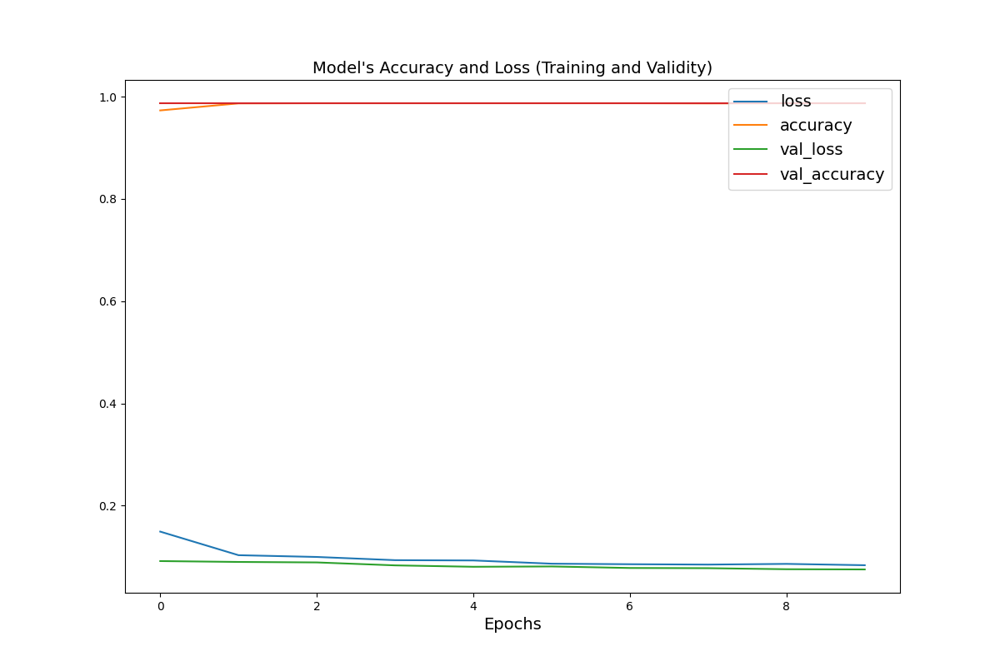
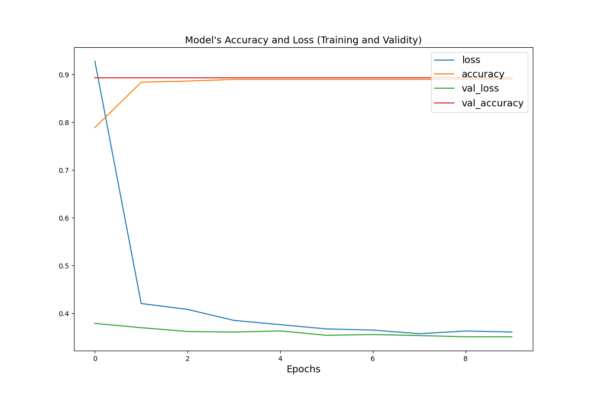
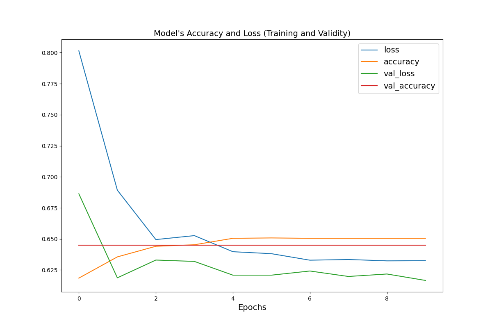
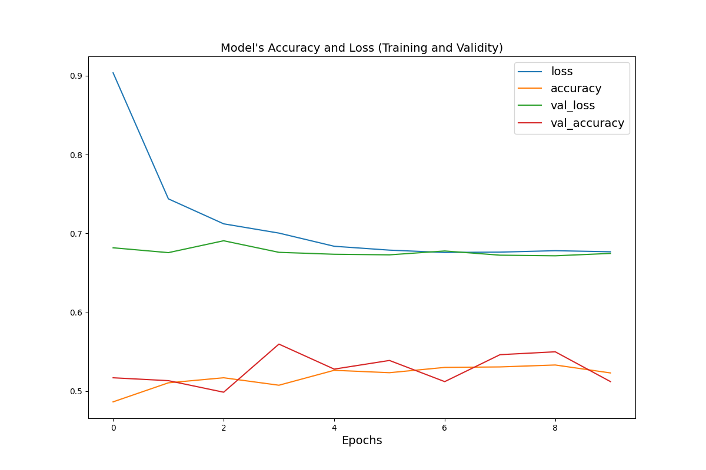

### Group work with Annabel Richter and John Willis
### The Setup
We used a city_person.csv file that contained the size, gender, age, education and wealth of different families. We imported this csv file into a pandas dataframe then created a new "wealthC" column into a "target" column that utilized binary. We also dropped the"wealthC' column as we didn't need it anymore. We also needed to clean our data a bit in order to avoid errors in our model. To clean the data up we ran two loops. Our first loop found any of the null values in the education column and dropped those null values from the data. Our second loop reassigned the values in our education and gender column from floats to integers. Once our data was cleaned we moved on to training the model. 

### Training the model 
We split our data up into 3 examples: training, validation and test. We had 3277 train examples, 820 validation examples and 1025 test examples. Once we split our data we used tf.data to create an input pipeline that allowed us to map the columns from the dataframe to features used to train the model. We used two types of feature columns for this data numeric (to represent our real valued features in age and size) and categorical (to represent gender, education and wealth). After choosing our feature columns we created, complied and trained the model.

### Analyzing the Results 
Our results showed that our model predicted the lower wealthC values really well with an accuracy rate of around .99%. We thought this was interesting so upon further investigation of the data we saw that the lower wealth section was only 64 data points. This made more sense as to why the model was preforming so well. As a stretch goal we decided to run our mode on the upper WealthC data points to see how well our model would preform with more data points since the upper WealthC had around 2,000 points. While this model still preformed well with an accuracy around 60% it did not preform as well as the lower wealth data.  This led us to believe that there was some overfitting within our model initially. We believe an improvement to our model would be preforming some kind of normalization on the data as well as collecting more data points for the lower wealth class. We believe that would produce a stronger model.

### Problem Solving 
While training our model for the lower wealth data points with the original parameters for the layers.Dense we found that the results strange. After investigating the data more closely we were able to see that the lower wealth data only had 64 data points but were running 128 layers.Dense model. We changed the model to be 64 layer.Dense and while this led to some overfitting it produced a more accurate model for different wealth levels across the entire dataset as well as for the lower wealth data. We were also getting Nan for our losses with our first run of the lower wealth dataset. At first, we thought the model was preforming so well our loss was negligible to the point that we were getting Nan. But, after running a model on the higher wealth data and recieving the same Nan val_loss with a lower accuracy we knew this wasn't the case. 
We were able to fix our losses by changing the batch size from 32 to 128. We were able to deduce that our output was somewhat unbounded which was resulting in very big numbers that produced Nan values; adjusting the batch size fixed this as it increased the stability of the optimization.