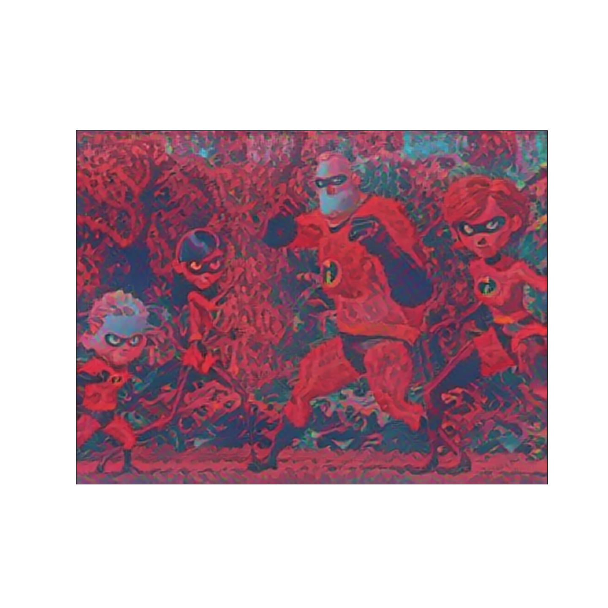

Project 4: Aashni, Cori, DJ, & Tyler
The script we produced using our RNN model is linked here

(1) How did you modify the data and python script in order to generate comprehensible text?

We modified the data of our script by removing out stage directions, setting descriptions, and scene split information. This made it easier for our model to produce a dialogue script because it was coding letters and making predictions from dialogue based text only. We did keep the names of the characters in our model including the predictive process but we found after testing with the characters name left in and taken out it didn’t make much difference in the accuracy level of the predictions. Within the python script we tested using a single prediction and a multitude of predictions with one character multiple times and different characters. Just from observation we noticed that the more different characters we have run through the model at once the more comprehensible the text seems to be however, we don’t have any proof that running multiple characters at once actually improves the output of the model. We also changed the epoch in the script running our model anywhere between 250-400 times in order to produce more comprehensible results. We also produced different sections of our dialogue from different models that ran on different epochs. This showed a lot of variety in the accuracy of our different models outputs as the epochs and temperature parameters were different for each section of the script. It helped not only to improve the comprehensibility of our script but reduced the randomness.
(2) Did your output seem to generate text that was relying more on the entire corpus of your screenplay (i.e. more associated with long-term memory) or was it also able to incorporate some more immediate sequential associations (i.e. more associated with short-term memory)?

Our model did a little bit of both. If you look at the majority of the script, one character would say a phrase, and then the next character would say something else unrelated. This is an example of long-term memory. However, there were a couple of instances where the dialogue exchange made some sense. For example, at one point Elastigirl says, ‘whatever happened to ‘‘ladies first’’?’ Mr Incredible then responds, ‘well, whatever happened to equal treatment?’ This exchange seems like a conversation that would take place in a real movie script. It shows the model using its short term memory to create a text that plays off of itself. Although most of the script was nonsensical, it was still cool to see that our code generated sentences that made sense, and occasionally exchanges that made sense. Overall we were pleased with the result.
(3) Did you make any changes to the model itself?

We didn’t make any changes to the model itself, but we did make changes to how we ran the model. For example, we increased the Epochs from 3 to the 100s to 200s. We were able to do this because our script was much shorter than the Shakespeare script, so the program was able to run faster. Additionally, in order to get a longer output, we increased the range of the for loop that ran the generate_one_step method from 1000 to the mid-2000s. To run the loop, we also changed the next_char variable from ROMEO to MR INCREDIBLE or another character in our dialogue. All of these changes helped us create a better output script. Other than those changes, our model and our code were the same as the code given to us by Tensorflow.
(4) Were there any unexpected or surprising phrases or statements that were generated by your RNN?

Our RNN model had some very interesting outputs, much of which was incomprehensible at points. Typically, the more epochs we ran the better the output tended to fair in terms of making sense. Even at the higher epochs that produced script we ended up using there were still points where a line or two was just jibberish. We also found it interesting that there was a lot of repetition in the outputs of our script. We had to run our model several times to get a script long enough to present, and each time we ran it there seemed to be several lines that remained consistent each time. For example, there are three different points in the script where the Interviewer says the lines “That’s fine.” An example of a jibberish line we had to cut is “Thank you, wa’‘m have to worry about training my flight it theam purediBgo tha wan ding.” This line was stated by one of the Police Officer characters. There were many examples like this, but there were also points when the model was trained at lesser epochs where there would be no understandable letter combinations in a line. Luckily, even with these surprising outputs we still generated enough output to put together a pretty funny script. An example of a pretty funny, and unexpected line would be when Mr. Incredible says “Sometimes I just clap, don’t you know? I’m just humping me first.” This was a very unexpected, but interesting output when we first read through the script.
(5) Stretch Goal: Image

