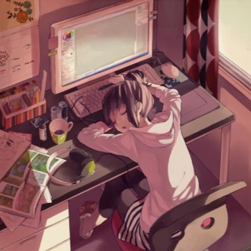
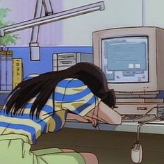
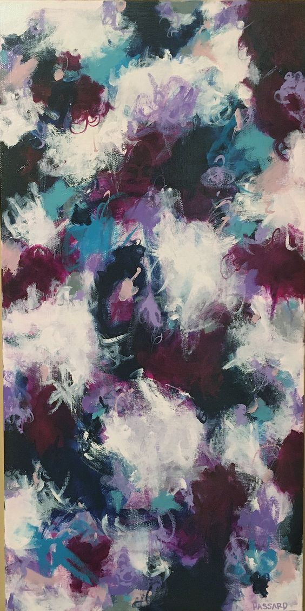
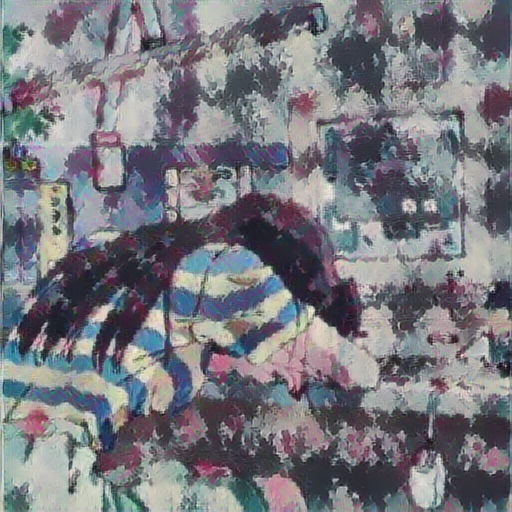
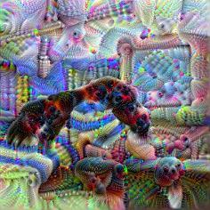

# Wednesday Informal Response 

To produce my images I began by importing all my libraries of course and configuring my modules. Once that was done I found four images I felt represented my summer semester as a Data Scientist and saved those to co-lab and copied the download links to put into my python script. 
After the images were downloaded I defined a function to show the four images in their maximum dimensions and displayed the images to ensure that everything had uploaded properly. 
Finally, I did a Fast Style Transfer using TF-Hub to produce the two new images below. 

##### Content Image 1

##### Style Image 1

##### Combined Image 1

##### Content Image 2

##### Style Image 2

##### Combined Image 2

I chose my images because it was a pretty good representation of my summer which was spent majority of the time in front of the computer working and asleep! While, that can sound boring we see through my art work which includes one of my favorite paintings starry night, and a beautiful pastel painting I found shows that even though my summer was busy I enjoyed all of it. 
Going forward as a Data Scientist I think my images remind me how I hope to continue to ground myself not only throughout college but my career. No matter how many times I end up working so late that I fall asleep in front of my computer, coding is one of my favorite things to do and like the paintings I chose, the magic of coding will always be beautiful and happy for me. 

#### Stretch Goal 

This is the DeepDream script that I produced of my second image. And I loved it! It's very trippy and gives me vibez from the 90s. I think it was a really cool way to interpret and update my artwork. 

